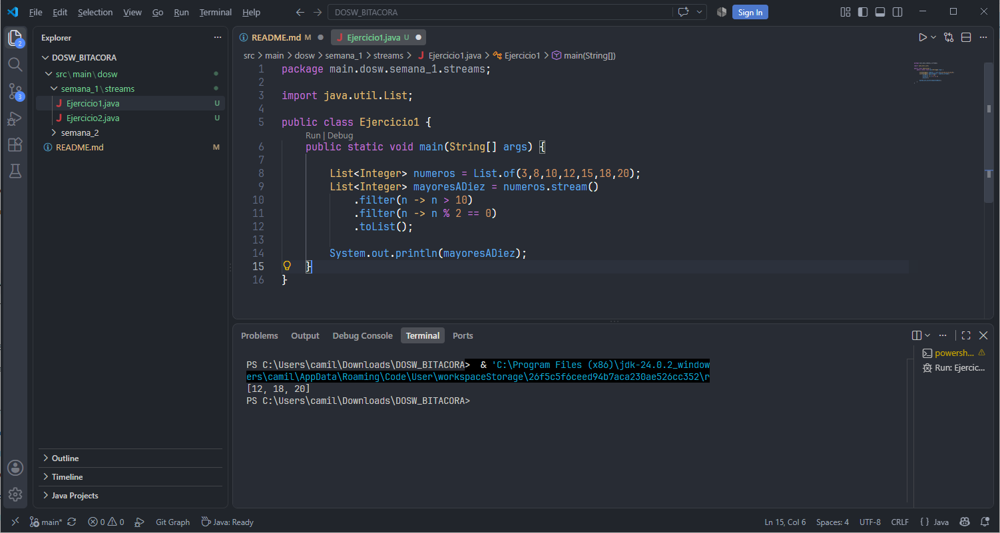

<style>
  @import url('https://fonts.googleapis.com/css2?family=JetBrains+Mono:wght@400;500;600;700&display=swap');
</style>

<div style="font-family: 'JetBrains Mono', monospace; font-weight: 600;">

# **Bitácora**

# SEMANA No 1 — DOSW Manejo de Streams 
 
## Datos personales: 
- Nombre y Apellido: Cristian Camilo Ortiz Sanchez
- Código de Estudiante: 1000105286
- Curso: DOSW-1

--- 

### Ejercicio 01 — Número Pares mayores a diez 

Dada una lista de números enteros, necesitamos obtener una nueva lista solo con los números pares mayores a 10.

| DATOS DE ENTRADA | SALIDA ESPERADA |
|----------|----------|
| [3, 8, 10, 12, 15, 18, 20]    | [12, 18, 20]    |

**Código implementado:**

```java

import java.util.List;

public class Ejercicio1 {
    public static void main(String[] args) {

        List<Integer> numeros = List.of(3,8,10,12,15,18,20);
        List<Integer> mayoresADiez = numeros.stream()
            .filter(n -> n > 10)
            .filter(n -> n % 2 == 0)
            .toList();

        System.out.println(mayoresADiez);
    }   
}
```
**Captura de ejecución:**



**Explicación:** Primero se convierte la lista a un stream, usando `numeros.stream()`, despues aplicamos dos filter, uno para que los números sean mayores a 10, y otros para que sean pares. Finalmente, se convierte en una lista, con el método `toList()` y se imprime.

</div>