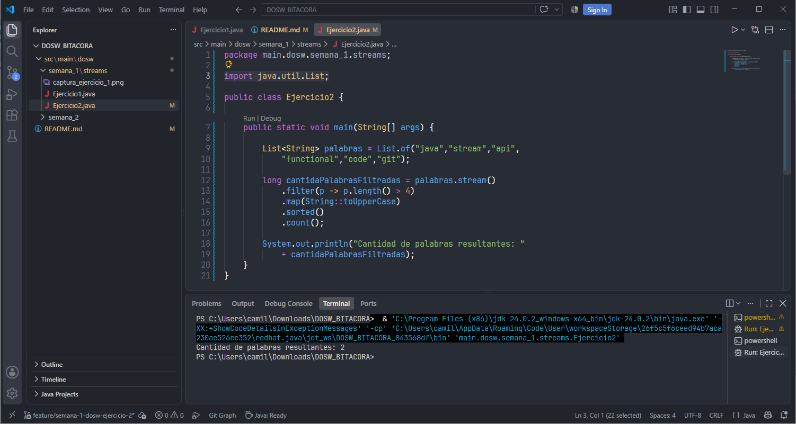
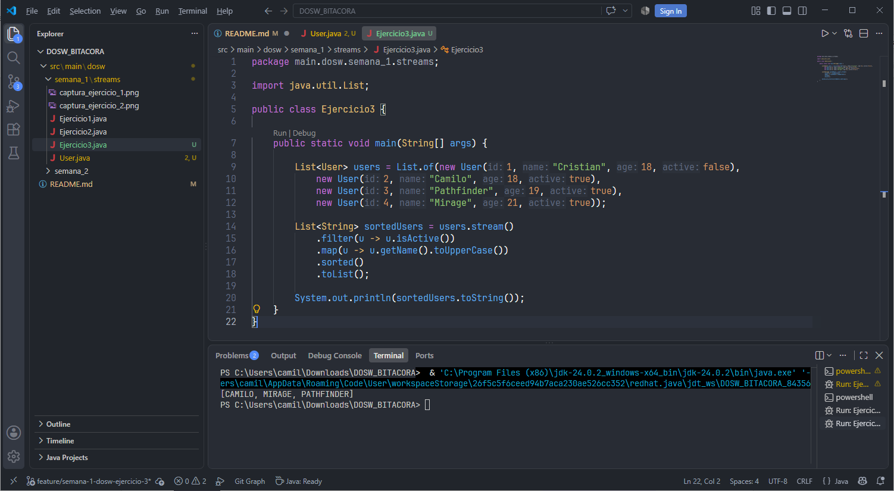
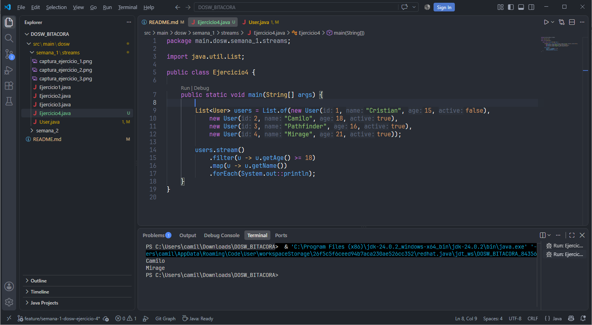
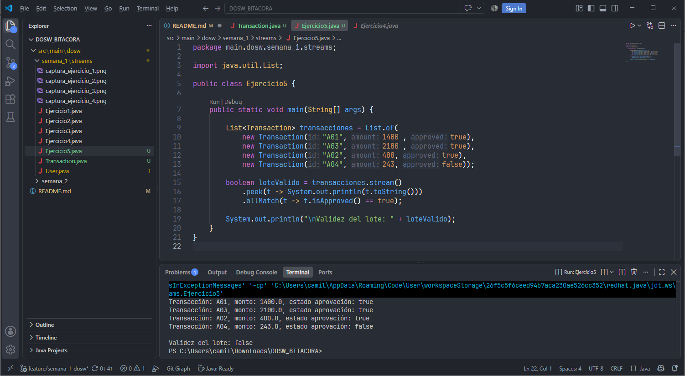

# **Bitácora**

# SEMANA No 1 — DOSW Manejo de Streams 
 
## Datos personales: 
- Nombre y Apellido: Cristian Camilo Ortiz Sanchez
- Código de Estudiante: 1000105286
- Curso: DOSW-1

--- 

### Ejercicio 01 — Número Pares mayores a diez 

Dada una lista de números enteros, necesitamos obtener una nueva lista solo con los números pares mayores a 10.

| DATOS DE ENTRADA | SALIDA ESPERADA |
|----------|----------|
| [3, 8, 10, 12, 15, 18, 20]    | [12, 18, 20]    |

**Código implementado:**

```java
import java.util.List;

public class Ejercicio1 {
    public static void main(String[] args) {

        List<Integer> numeros = List.of(3,8,10,12,15,18,20);
        List<Integer> mayoresADiez = numeros.stream()
            .filter(n -> n > 10)
            .filter(n -> n % 2 == 0)
            .toList();

        System.out.println(mayoresADiez);
    }   
}
```
**Captura de ejecución:**


**Explicación:** Primero se convierte la lista a un stream, usando `numeros.stream()`, despues aplicamos dos filter, uno para que los números sean mayores a 10, y otros para que sean pares. Finalmente, se convierte en una lista, con el método `toList()` y se imprime.

---

### Ejercicio 02 — Cantidad de Palabras con más de 4 caracteres

Dada una lista de palabras, se requiere: 

- Filtrar las palabras que tengan más de 4 caracteres 
- Convertirlas en Mayúsculas 
- Ordenarlas alfabéticamente 
- Obtener la cantidad total de palabras resultantes 

| DATOS DE ENTRADA | SALIDA ESPERADA |
|----------|----------|
| ["java","stream","api","functional","code", “git”]    | Cantidad de palabras resultantes: 2    |

**Código implementado:**

```java
import java.util.List;

public class Ejercicio2 {

    public static void main(String[] args) {
        
        List<String> palabras = List.of("java","stream","api",
            "functional","code","git");

        long cantidaPalabrasFiltradas = palabras.stream()
            .filter(p -> p.length() > 4)
            .map(String::toUpperCase)
            .sorted()
            .count();

        System.out.println("Cantidad de palabras resultantes: " 
            + cantidaPalabrasFiltradas);
    }
}
```
**Captura de ejecución:**



**Explicación:** Se convierte la lista a un stream, aplicamos un `filter()` para las palabras con longitud mayor a 4, usamos map para convertir a mayusculas mediante el metodo `toUpperCase()` y con `count()`, devolvemos la cantidad de elementos.

---

### Ejercicio 03 — Obtener nombres de los Usuarios

Dada una lista de usuarios con los atributos: id, name, age, active 

Filtra únicamente los usuarios activos, obtén una lista con los nombres en mayúscula y ordenada alfabéticamente. 

| DATOS DE ENTRADA | SALIDA ESPERADA |
|----------|----------|
| `users = List<User>`   | `sortedUsers = List<String>`    |

**Código implementado:**

```java
public class User {

    private int id;
    private String name;
    private int age;
    private boolean active;

    public User(int id, String name, int age, boolean active) {
        this.id = id;
        this.name = name;
        this.age = age;
        this.active = active;
    }

    public String getName() {
        return name;
    }

    public boolean isActive() {
        return active;
    }
}

import java.util.List;

public class Ejercicio3 {

    public static void main(String[] args) {
        
        List<User> users = List.of(new User(1, "Cristian", 18, false),
            new User(2, "Camilo", 18, true),
            new User(3, "Pathfinder", 19, true),
            new User(4, "Mirage", 21, true));

        List<String> sortedUsers = users.stream()
            .filter(u -> u.isActive())
            .map(u -> u.getName().toUpperCase())
            .sorted()
            .toList();

        System.out.println(sortedUsers.toString());
    }  
}
```
**Captura de ejecución:**



**Explicación:** Para ordenar los usuarios activos se convierte la lista de usuarios a un Stream, despues se filtran los activos, y mediante el método `map()` obtenemos el nombre de cada usuario y lo transformamos en mayusculas, ordenamos usando `sorted()` y lo convertimos a lista usando `toList()`.

---

### Ejercicio 04 — Personas mayores de edad 

Dado un listado de Usuarios y utilizando los mismo atributos anteriores, filtrar las personas mayores de edad y obtener sus nombres.

**Código implementado:**

```java
public class Ejercicio4 {
    
    public static void main(String[] args) {
        
        List<User> users = List.of(new User(1, "Cristian", 15, false),
            new User(2, "Camilo", 18, true),
            new User(3, "Pathfinder", 16, true),
            new User(4, "Mirage", 21, true));

        users.stream()
            .filter(u -> u.getAge() >= 18)
            .map(u -> u.getName())
            .forEach(System.out::println);
    }
}
```
**Captura de ejecución:**



**Explicación:** Se convierte la lista a un stream, aplicamos un `filter()` para los usuarios con edad mayor o igual a 18, usamos map para obtener el nombre e imprimimos cada uno.

---

### Ejercicio 05 — Transacciones Bancarias

Dada una lista de transacciones bancarias representadas por objetos: 

`class Transaction { String id; double amount; boolean approved; }` 

Se requiere procesar la lista usando Streams para: 

- Usar peek para ver cada transacción procesada (Utilizar System.out.println para ver la transacción) 
- Verificar si existe al menos una transacción no aprobada 
- Retornar true o false indicando si el lote de transacciones es válido.

**Código implementado:**

```java
public class Transaction {
    
    private String id;
    private double amount;
    private boolean approved;

    public Transaction(String id, double amount, boolean approved) {
        this.id = id;
        this.amount = amount;
        this.approved = approved;
    }

    public boolean isApproved() {
        return approved;
    }

    public String toString() {
        return "Transacción: " + id + ", monto: " 
            + amount + ", estado aprovación: " + approved;
    }
}

public class Ejercicio5 {
    
    public static void main(String[] args) {
        
        List<Transaction> transacciones = List.of(
            new Transaction("A01", 1400 , true),
            new Transaction("A03", 2100 , true),
            new Transaction("A02", 400, true),
            new Transaction("A04", 243, false));

        boolean loteValido = transacciones.stream()
            .peek(t -> System.out.println(t.toString()))
            .allMatch(t -> t.isApproved() == true);

        System.out.println("\nValidez del lote: " + loteValido);
    }
}
```
**Captura de ejecución:**



**Explicación:** Se transforma la lista de transacciones en un Stream, se hace peek de sus elementos para imprimirlos y al final se hace uso de `allMatch()` para retornar si todas las transacciones han sido aprovadas. 

---

# SEMANA No 2 — Bitácora Pokémon 

## Datos de Entrenador: 

- Nombre y Apellido: Cristian Camilo Ortiz Sanchez
- Código de Estudiante: 1000105286
- Curso: DOSW-1

--- 